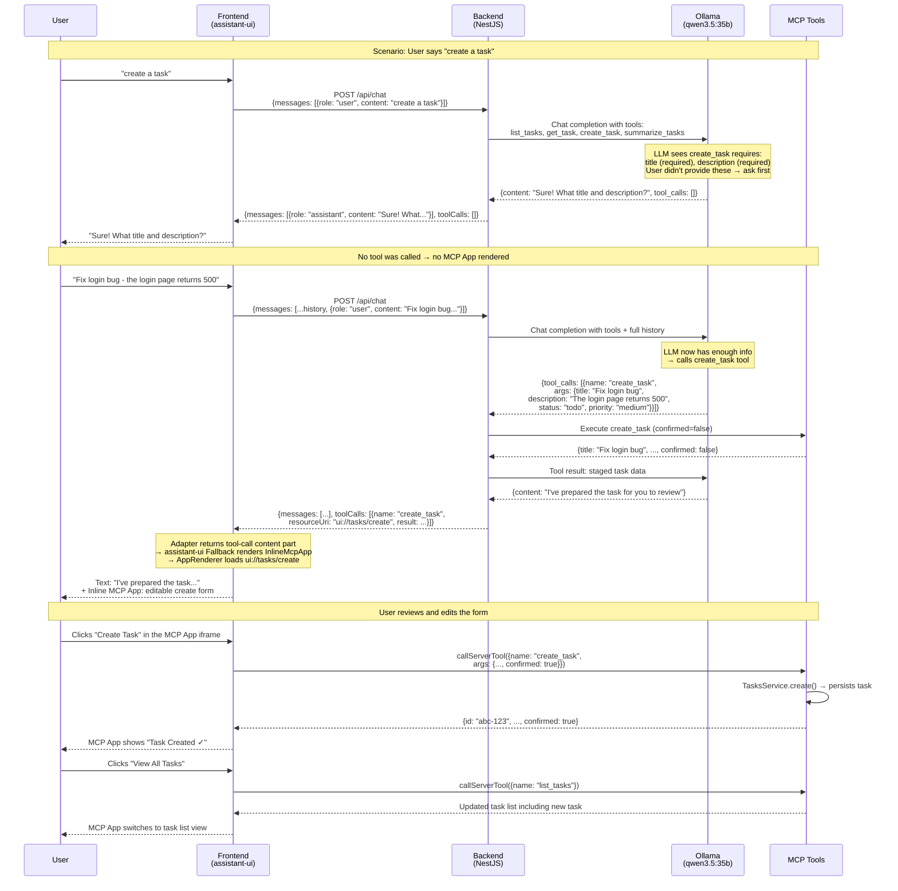

# Create Task Flow

How a task gets created through the MCP App — from user intent to persisted data.

The key insight: the LLM decides when it has enough information to call the `create_task` tool. Our code defines the required parameters (`title`, `description`), but the model exercises judgment about whether to ask for more info or call the tool immediately.

## Who controls what

| Decision | Who decides |
|----------|------------|
| Whether to ask for more info or call the tool immediately | The LLM |
| What parameters are required for the tool | Our tool definition (`required: ['title', 'description']`) |
| Whether to stage or persist the task | Our `create_task` handler (based on `confirmed` flag) |
| Whether to show the MCP App inline | assistant-ui's `tools.Fallback` (renders when tool-call content parts exist) |
| What the form looks like | The `task-create` MCP App view |
| Whether the task gets saved | The user clicking "Create Task" in the form |
